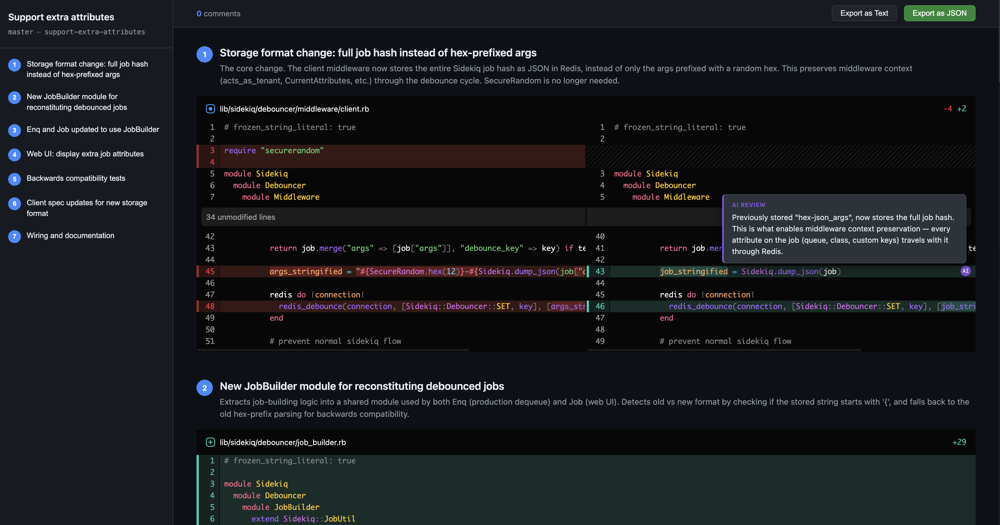

# help-me-review

A Skill that organizes large code diffs into small, logically grouped sections with an interactive HTML review page.



## What it does

1. Splits a raw diff into individual hunks (blocks)
2. The model reads all blocks, groups them by logical concern (not file boundaries), and writes inline comments explaining *why* changes were made
3. Assembles the grouped sections into a structured JSON, validates 100% line coverage
4. Generates a self-contained HTML review page with split-view diffs (powered by [@pierre/diffs](https://diffs.com)), model annotations, and interactive user commenting

## Setup

Repo contains already prebuild UI bundle. So there is no need to build it manually.

## Usage

Invoke the skill in Claude Code:

```
/help-me-review [PR or branch or commit]
```

## Build

Build the React UI (requires [bun](https://bun.sh/)):

```bash
cd ui
bun install
bun run build
```

This produces `ui/dist/index.html` — a single self-contained HTML file used as the template for generated reviews.

## Review page features

- Split-view diffs with Shiki syntax highlighting
- Model comments as purple inline annotations
- Click any line to add your own comments (blue inline annotations)
- Export comments as JSON or plain text to paste back to the model
- Dark theme, fixed sidebar with section navigation
